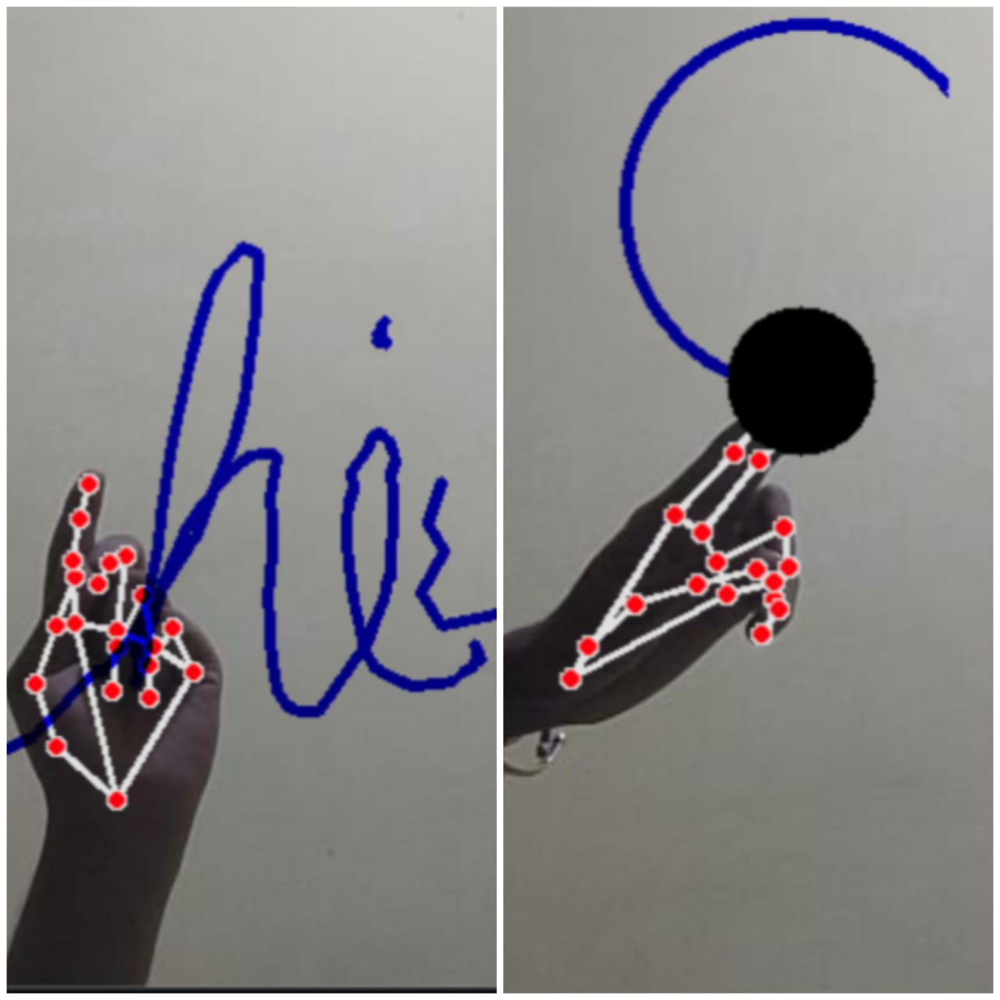

# Virtual Drawing Board
Which is a **computer-based vision system** which is used to draw on screen by detecting the motion of index finger with the camera. 
The idea of making a software using AI in python, useful in online teaching, presenting presentations and in various other industries. 
In present condition online teaching has become an alternate mode of teaching via online meets, without using any external devices for drawing or writing on screen one can use **Virtual Drawing Board** just by opening their camera and using index finger with its motion they can draw or write. 
There are various colour options and clear screen option to clear the screen. This will help the user to differentiate and explain in better way. It can replace the technique of using other gadgets for drawing on screen.
We went through various literature papers and found out insights about our topic. Teachers, students and employees can use it in their online as well as offline classroom and offices. Cheaper than the usual **smart digital boards**. Requires less space and nothing extra than just our hand to work with. We are using the computer vision techniques of OpenCV to build this application. 
The project can be made even better by adding a multicore module and hand contour recognition. Deep learning of OpenCV is used in order to improve hand gesture tracking.

Here is the demo of the project 👇👇

